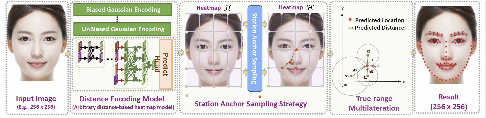
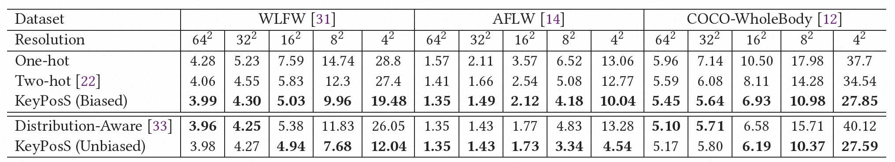

# KeyPosS

## KeyPosS: Plug-and-Play Facial Landmark Detection through GPS-Inspired True-Range Multilateration
<p align='left'>
  
</p>

<br>**[[Paper](https://arxiv.org/abs/2305.16437)]** <br />


## Performance
<p align='left'>
  
</p>


## Quick Start

### Installation
You can refer to [mmpose](https://github.com/open-mmlab/mmpose) to install the whole environments.

our experiment is trained and tested on COCO, WFLW, 300W, COFW and AFLW dataset, train and test script as following.

### Train
We use imagenet models offered by [mmpose](https://github.com/open-mmlab/mmpose) as our pretrained models.

```shell
CUDA_VISIBLE_DEVICES=0,1,2,3 sh tools/dist_train.sh \
    configs/face/2d_kpt_sview_rgb_img/topdown_heatmap/coco_wholebody_face/hrnetv2_w18_coco_wholebody_face_256x256_dark.py \
    4 \
    --work-dir exp/exp889
```

### Evaluation
The pretrained models and already-trained-models on each dataset and heatmap resolution are available on [google drive](https://drive.google.com/drive/folders/1gIH6GCVdSH7K0O1_Ohy9sJCRNdsQjnwY)

1. Copy the model file "exp" to the code root directory

2. Runs the test script run_test_64.sh/run_test_32.sh/run_test_16.sh/run_test_8.sh/run_test_4.sh/，test the performance of the model on all face datasets (WFLW/COCO/300W/AFLW/COFW) at different resolutions.

3. Note that you need to manually modify the resolution in the "data_cfg/heatmap_size" field in the configuration file before running the test script, The model in "exp" supports five resolutions of 64/32/16/8/4

For details, please refer to the test script run_test_64.sh/run_test_32.sh/run_test_16.sh/run_test_8.sh/run_test_4.sh。

```shell
CUDA_VISIBLE_DEVICES=0,1,2,3 sh tools/dist_test.sh \
    configs/face/2d_kpt_sview_rgb_img/topdown_heatmap/wflw/hrnetv2_w18_wflw_256x256_dark.py \
    exp/exp_v1.3.0/best_NME_epoch_60.pth \
    4 
```


## Acknowledgment
Our implementation is mainly based on [mmpose](https://github.com/open-mmlab/mmpose). We gratefully thank the authors for their wonderful works.


## Citation
Please cite the following paper if this repo helps your research:
```bibtex
@misc{bao2023keyposs,
      title={KeyPosS: Plug-and-Play Facial Landmark Detection through GPS-Inspired True-Range Multilateration}, 
      author={Xu Bao and Zhi-Qi Cheng and Jun-Yan He and Chenyang Li and Wangmeng Xiang and Jingdong Sun and Hanbing Liu and Wei Liu and Bin Luo and Yifeng Geng and Xuansong Xie},
      year={2023},
      eprint={2305.16437},
      archivePrefix={arXiv},
      primaryClass={cs.CV}
}
```

## License
This repo is released under the Apache 2.0 license. Please see the LICENSE file for more information.

